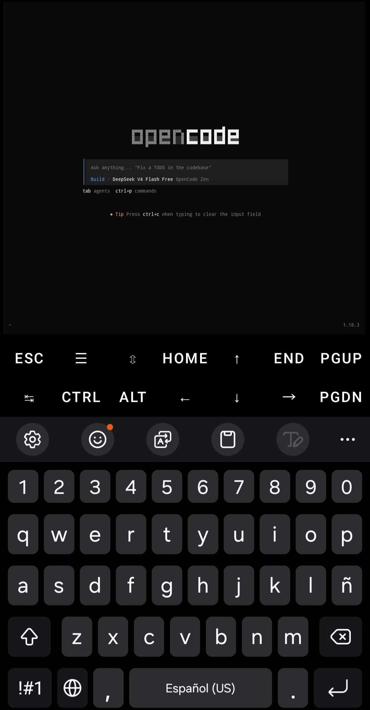

# OpenCode — Termux

<p align="center">
  
</p>

Instalacion nativa de **OpenCode** en Termux para Android ARM64.
Sin proot, sin VMs, sin Cloud Shell.

Este proyecto descarga el **binario oficial** de OpenCode (build glibc) y lo
ejecuta con un **launcher nativo Android** a traves de la capa glibc de Termux.
Usa varias fuentes de descarga por prioridad:

1. **Vendor oficial** — GitHub de `anomalyco/opencode` (siempre la ultima version)
2. **Espejo propio** — Release de este repositorio
3. **npm oficial** — paquete de plataforma `opencode-linux-arm64`
4. **termuxvoid** — paquete Termux `opencode` (ultimo recurso)

Corre de forma nativa en Android ARM64.

---

## Requisitos

- **Termux** instalado desde [F-Droid](https://f-droid.org/packages/com.termux/)
  (no desde Google Play)
- **Dispositivo Android ARM64** (aarch64)
- **Conexion a internet** para descargar el binario (~90-180MB) y la capa glibc
- Espacio libre: ~200MB

---

## Instalacion

```bash
# Clonar el repositorio
git clone https://github.com/sebastianl1/opencode-termux.git
cd opencode-termux

# Ejecutar el instalador
bash install.sh
```

El instalador es interactivo y te guiara paso a paso:

1. Verifica el entorno (Termux, arquitectura)
2. Instala la capa glibc de Termux (repositorio oficial `glibc-repo`)
3. Descarga el binario oficial (vendor -> espejo -> npm -> termuxvoid)
4. Compila el launcher nativo Android
5. Verifica la instalacion
6. Te muestra los proximos pasos para configurar un proveedor de IA

---

## Que instala

| Componente | Ruta | Descripcion |
|------------|------|-------------|
| `opencode` | `$PREFIX/bin/opencode` | Launcher nativo Android (C, compilado) |
| `opencode.real` | `$PREFIX/share/opencode/` | Binario real de OpenCode (build glibc) |
| `~/.config/opencode/` | Directorio de usuario | Configuracion de OpenCode |

### Como funciona

OpenCode se ejecuta de forma nativa en Termux:

- **Sin proot** — No necesita contenedores ni emulacion
- **Launcher Android** — Un launcher nativo (Bionic) invoca el cargador glibc
  (`ld-linux-aarch64.so.1`) para lanzar el binario glibc de OpenCode
- **Sin Cloud Shell** — Corre directamente en tu dispositivo
- **Nativo ARM64** — Optimizado para arquitectura aarch64

---

## Uso

### Iniciar OpenCode

```bash
opencode
```

### Verificar version

```bash
opencode --version
```

### Ver ayuda

```bash
opencode --help
```

### Actualizar

```bash
bash install.sh   # reinstala con la ultima version
```

> Si opencode se instalo como paquete termuxvoid (ultimo recurso), actualiza con:
> `pkg upgrade opencode`

### Comandos principales

| Comando | Descripcion |
|---------|-------------|
| `opencode` | Iniciar la CLI interactiva |
| `opencode --version` | Mostrar version |
| `opencode --help` | Mostrar ayuda |
| `bash install.sh` | Actualizar a la ultima version |
| `opencode auth login` | Autenticar con un proveedor de IA |

---

## Configuracion de proveedores

OpenCode necesita un proveedor de IA para funcionar. Despues de instalar,
configura tu proveedor preferido:

```bash
opencode auth login
```

Sigue las instrucciones en pantalla para autenticar con:
- **Google** (Gemini)
- **OpenAI** (GPT)
- **Anthropic** (Claude)
- **GitHub Copilot**
- O cualquier proveedor compatible con OpenCode

---

## Desinstalacion

Para desinstalar opencode:

```bash
bash install.sh --uninstall
```

Esto desinstala el launcher y el binario (o el paquete Termux si aplica) y
ofrece eliminar la configuracion.
Para eliminar los respaldos manualmente:

```bash
rm -rf ~/backups/opencode
```

---

## Estructura del proyecto

```
opencode-termux/
├── imagenes/
│   └── opencode-banner.jpg   # Banner del proyecto
├── launcher.c                # Launcher nativo Android (se compila en la instalacion)
├── tools/
│   └── update-mirror.sh      # Actualiza el espejo del binario en GitHub Releases
├── install.sh                # Script de instalacion
├── README.md                 # Este archivo
└── LICENSE                   # Licencia MIT
```

---

## Autor

**Sebastian Laguna** — Creador y mantenedor del proyecto

---

## Licencia

Este proyecto esta bajo la licencia MIT. Ver el archivo [LICENSE](LICENSE).
